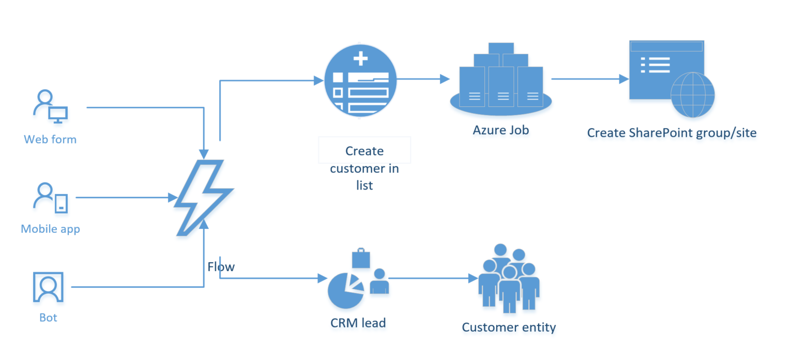

# There is no spoon #

# Puzzlepart Appsters @ the Arctic SharePoint Challenge 2017 #

This repository contains the Puzzlepart solution for ASPC17.

## Objective ##

Our objective is quite dynamic at this point (agile!). Our Endlösung is to onboard citizens onto ships to fight the system. Ships will have their own Office 365 groups with ship members to collaborate. We're focusing on the provisioning part of solution from the start - allowing people to report interest and onboard ships using different means.

## Architecture ##
We plan to do the following solution and architecture.

At it's core, we will create a provisioning solution to create user and ship entities in CRM and ship sites in Office 365, which are interlinked. We will use a central SharePoint list to be used as a data source for the entities.

We will use a web form, mobile-supported power app and the bot framework (gitter/slack/teams) to create ships.

## Join in! ##

## Tool stack ##

* OfficePnP PowerShell with the Provisioning Schema
* gulp to build
* typescript for business logic
* composed looks and LESS for styling
* PowerShell in an Azure web job for provisioning groups and sites
* Heroku as bot service

## Development pre-requisites ##

1. Install the latest version of OfficePnP PowerShell
2. Install node package manager with node.js
3. (Not mandatory) Use Windows Credential Manager to store credentials

## Development setup ##

1. Clone the repo
2. npm install
3. gulp
4. Apply CDN-template: Install the template Provision/Templates/CDN/template.xml to /sites/pzl-CDN
5. Apply Directory-template: Install the template Provision/Templates/SiteCatalogue/template.xml to /sites/Directory

You should be good to go!